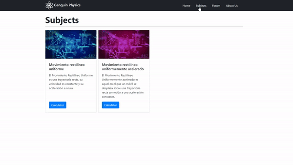

<h1 align="left">Hi, let me tell you a bit about me</h1>

<!--
**pedrofdzl/pedrofdzl** is a ✨ _special_ ✨ repository because its `README.md` (this file) appears on your GitHub profile.

Here are some ideas to get you started:

- 🔭 I’m currently working on ...
- 🌱 I’m currently learning ...
- 👯 I’m looking to collaborate on ...
- 🤔 I’m looking for help with ...
- 💬 Ask me about ...
- 📫 How to reach me: ...
- 😄 Pronouns: ...
- ⚡ Fun fact: ...
-->

I'm a Computer Science Engineer student on my third semester at ITESM. I like to learn new thing and to implement them in my personal projects.

<h2 align="left">Some of my projects</h2>

<h3 align="left">A Trip to the Sun</h3>

This project of mine is the one that got me into the beautiful world of code back in 2019, I learned a lot of C#, animation, physics engines, and about game engines (Unity) from this project, since all of it is made by myself. It's a single player story-based video game, set in the near-future. I'm currently still working on it.

  

    
    
  

  

    
    
  

<h3 align="left">Genguin Physics</h3>

GGenguin Physics is an online app built on the Flask framework, with it's backend written in Python. It's purpose is to help high-school students understand the steps necessary to solve the most common physics problems seen in highschool. This app aims to help out students with a friendly interface and a well thought-out backend. This project, as any other, inspires me to learn and grow as a developer.

  

    
    
  

<h3 align="left">Genguin Education</h3>

Genguin is a lightweight, easy to use, and simple educational platform in which independent teachers or tutors can upload assignments, quizzes, lectures, and blog post to different groups organized as classes for their students to see, answer and comment on; they can do this from any device with a web browser. My team and I are still working on this project, giving it an interesting twist to differentiate it from all of the other educational platforms. This project was originally made for HackMTY21.

<h2 align="left">Skills</h2>
<h3>Languages:</h3>
<h3>
  
  
  
  
</h3>

<h3>Front-end:</h3>
<h3>
  
  
  
</h3>

<h3>Database and frameworks:</h3>
<h3>
   </a>
  
</h3>

<h3>Other (Software and Game Engines):</h3>
<h3>
  
  
  
    
</h3>
